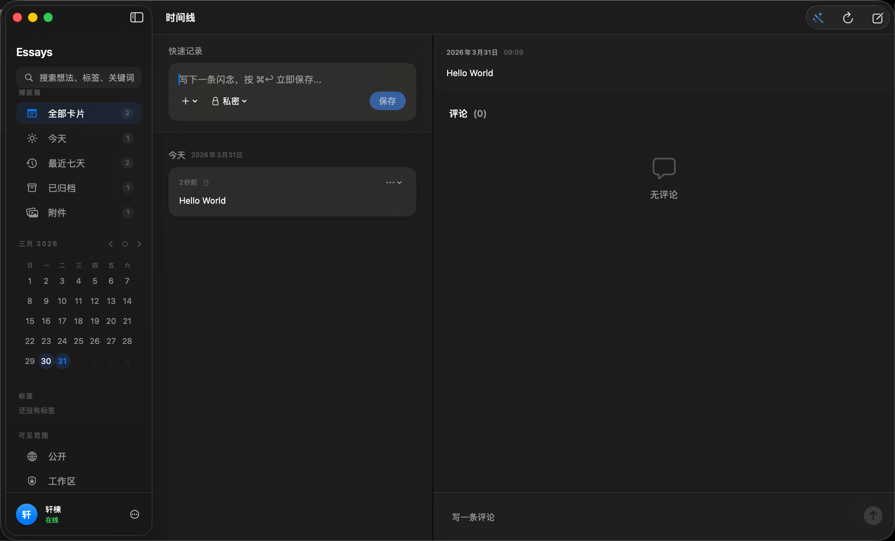
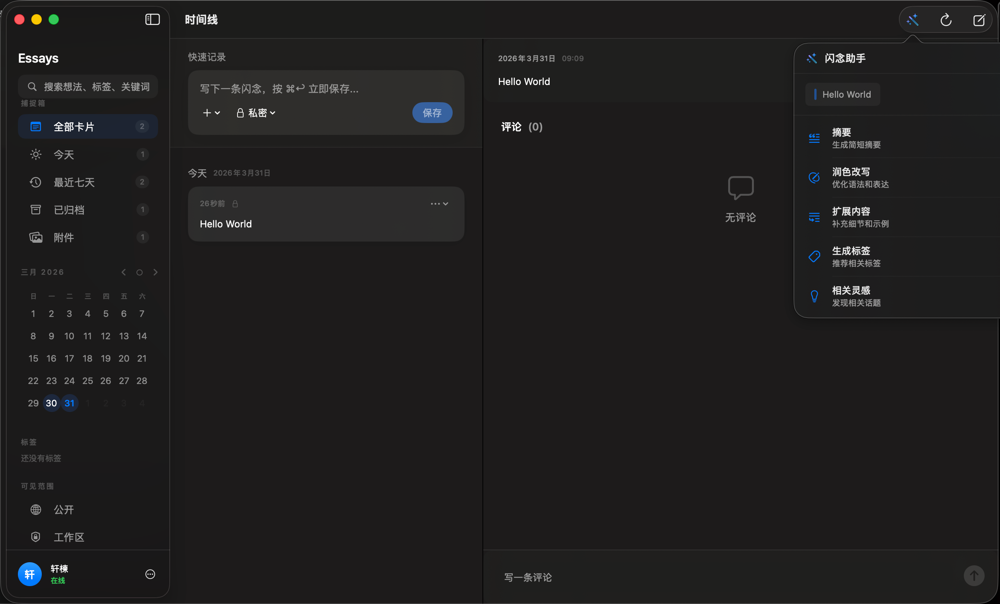
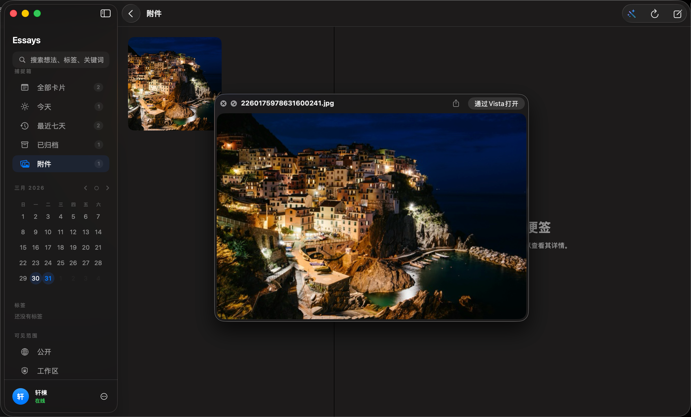
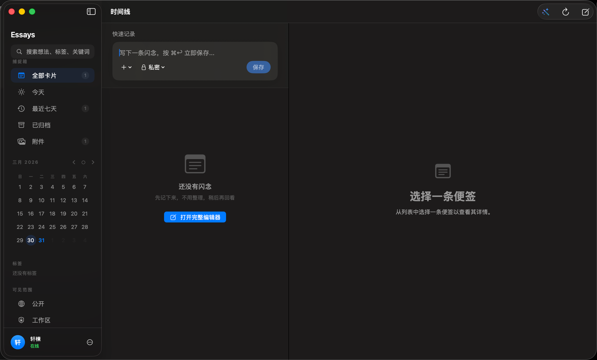

# 闪念 (Essays)

**闪念 (Essays)** 是一款为 [Memos](https://usememos.com) 开源笔记服务量身打造的 macOS 原生客户端。使用 SwiftUI 构建，专注于极简体验与视觉美感，为您提供捕捉灵感、记录日记和整理想法的无缝体验。

## 功能特性

- 📴 **离线优先架构**: 全新设计的同步层，允许您在没有网络连接的情况下创作、编辑和删除笔记。
- 📬 **同步队列查看器**: 侧边栏新增专属面板，实时监控本地更改的挂起状态及后台同步进展。
- 📱 **全平台通用**: 原生支持 macOS、iPadOS 与 iOS，在您所有设备间提供统一且强大的体验。
- 🔀 **三栏式导航**: 采用响应式标准的 `NavigationSplitView` 架构，最大化利用屏幕空间（侧边栏、时间线及详情页）。
- ✨ **极致原生视觉**: 采用 "LiquidGlass" 设计语言，深度集成毛玻璃效果、超薄材质与细腻的微交互动画。
- 🤖 **Apple AI 助手**: 集成原生基础大模型，提供纯本地、私密的智能文本处理能力。
- 🚀 **全局快捷键与闪念记录**: 设置自定义全局快捷键，随时随地在 Mac 上唤出快捷输入面板捕捉灵感。
- 🖼️ **附件画廊**: 侧边栏专属网格视图，让您优雅地浏览所有包含图片的备忘录。
- 🔍 **丰富的媒体预览**: 支持原生的 Apple 快速查看（Quick Look）图片附件，以及交互式的 MapKit 地图气泡预览位置标签。
- 📅 **交互式日历**: 侧边栏集成的响应式月历，一键筛选每日日志。
- 🕒 **时间线视图**: 优雅的按日期分组的纪实呈现，让回忆有迹可循。
- 🌍 **全量国际化**: 完整支持中英文切换，适配您的语言习惯。
- 🔒 **隐私安全**: 通过访问令牌（Access Token）直接连接到您的自托管 Memos 服务器。

## 软件截图

<p align="center">
  
  
</p>
<p align="center">
  
  
</p>

## Apple AI 助手

利用 Apple 原生基础大模型（Foundation Models）的力量，提升您的创作与思考效率：

- ✨ **智能摘要**: 为长篇备忘录快速生成简洁摘要。
- ✏️ **润色文本**: 优化语法、语气并提升表达清晰度。
- 📝 **内容扩充**: 基于简短想法进行逻辑扩充，丰富细节。
- 🏷️ **自动标签**: 智能建议最相关的分类标签。
- 💡 **灵感关联**: 通过 AI 挖掘想法间的深层联系，启发新观点。

所有 AI 处理均在 **Mac 本地运行**，确保您的想法与数据绝对私密，不经过任何第三方服务器。

## 安装指南

### 直接下载
从 [Releases](https://github.com/lpgneg19/Essays/releases) 页面下载最新的 `.dmg` 或 `.app` 文件。

### Homebrew
通过 Homebrew tap 安装：
```bash
brew tap lpgneg19/tap
brew install --cask essays
```

### 从源码编译
1. 克隆本仓库。
2. 安装 [XcodeGen](https://github.com/yonaskolb/XcodeGen) (`brew install xcodegen`)。
3. 在项目根目录运行 `xcodegen generate`。
4. 使用 Xcode 打开 `Essays.xcodeproj` 并运行。

## 配置说明

首次启动时，您需要输入：
- **服务器地址**: 您的 Memos 实例链接 (例如：`https://memos.example.com`)。
- **访问令牌**: 在 Memos 设置中生成的个人访问令牌。

## 开源协议

本项目采用 [Mozilla Public License 2.0](LICENSE) 协议。

---

[English Version / 切换至英文版](README.md)
