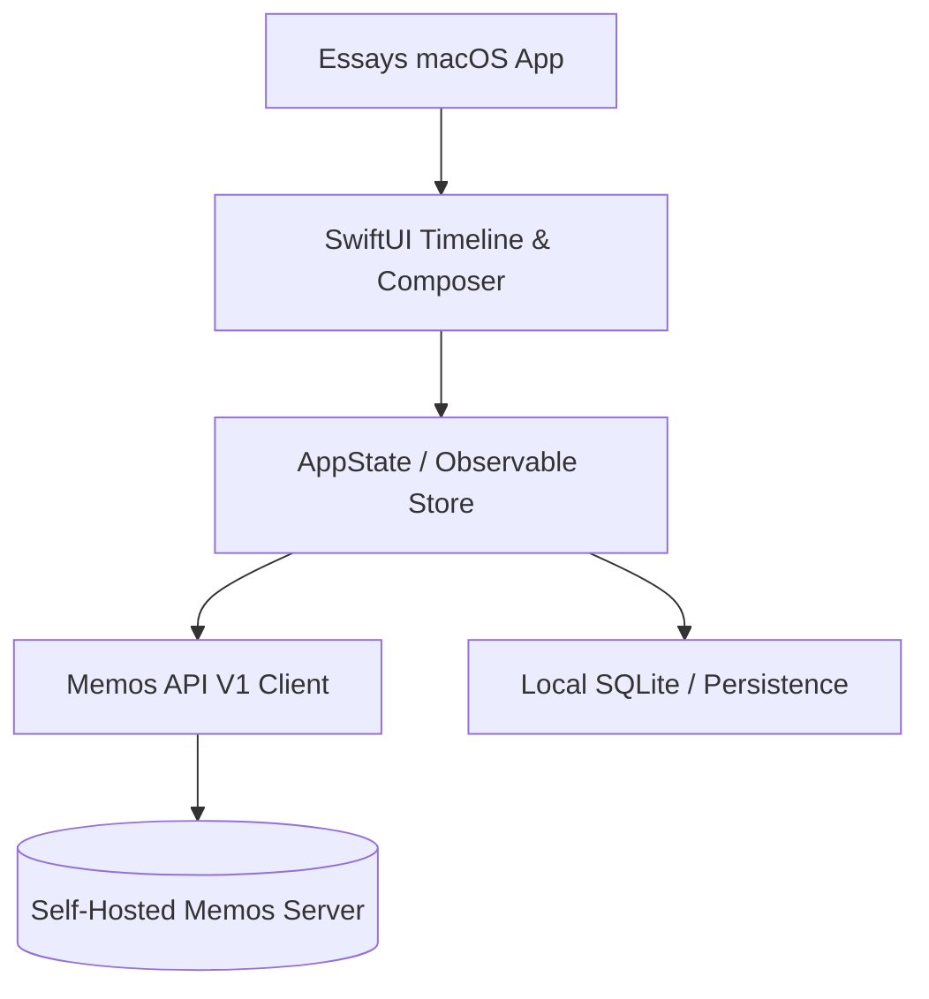

# System architecture

```mermaid
graph TD
    App[Essays macOS App] --> Views[SwiftUI Timeline & Composer]
    Views --> State[AppState / Observable Store]
    State --> API[Memos API V1 Client]
    State --> Cache[Local SQLite / Persistence]
    API --> MemosServer[(Self-Hosted Memos Server)]
```
