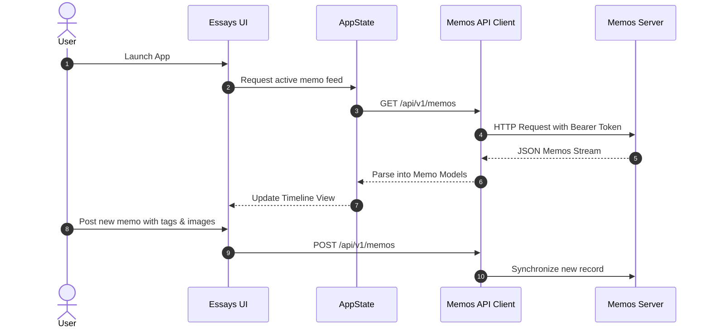

# Key flows

```mermaid
sequenceDiagram
    autonumber
    actor User
    participant UI as Essays UI
    participant State as AppState
    participant API as Memos API Client
    participant Server as Memos Server

    User->>UI: Launch App
    UI->>State: Request active memo feed
    State->>API: GET /api/v1/memos
    API->>Server: HTTP Request with Bearer Token
    Server-->>API: JSON Memos Stream
    API-->>State: Parse into Memo Models
    State-->>UI: Update Timeline View
    User->>UI: Post new memo with tags & images
    UI->>API: POST /api/v1/memos
    API->>Server: Synchronize new record
```
